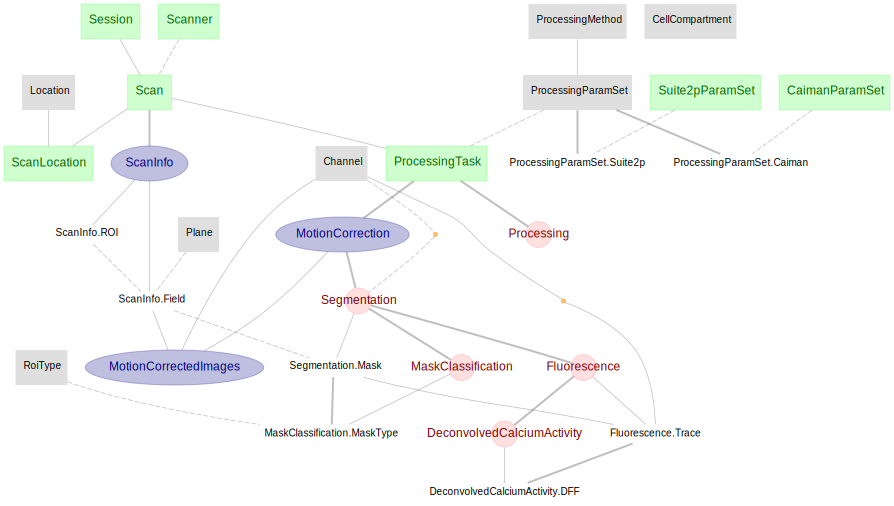

# DataJoint Element - Canonical Functional Calcium Imaging
DataJoint Element for Calcium imaging.
This repository features DataJoint pipeline design for functional Calcium imaging, 
with ***ScanImage*** acquisition system and ***Suite2p*** or ***CaImAn*** suites for analysis. 

The pipeline presented here is not a complete pipeline by itself, but rather a modular 
design of tables and dependencies specific to the functional Calcium imaging workflow. 

This modular pipeline element can be flexibly attached downstream 
to any particular design of experiment session, thus assembling a fully functional 
calcium imaging pipeline.

## The Pipeline Architecture

As the diagram depicts, the imaging element starts immediately downstream from ***Session***, 
and also requires some notion of:
+ ***Scanner*** for equipment/device
+ ***Location*** as a dependency for ***ScanLocation***

### The pipeline architecture describing a ***Scan***
A ***Session*** (more specifically an experimental session) may have multiple scans, 
where each scan describes a complete 4D dataset (i.e. 3D volume over time) from one scanning session, 
typically from the moment of pressing the *start* button to pressing the *stop* button.

+ ***Scan*** - table containing information about the equipment used (e.g. the Scanner information)
+ ***ScanInfo*** - meta information about this scan, from ScanImage header (e.g. frame rate, number of channels, scanning depths, frames, etc.)

+ ***ScanInfo.Field*** - a field is a 2D image at a particular xy-coordinate and plane (scanning depth) within the field-of-view (FOV) of the scan.

    For resonant scanner, a field is usually the 2D image occupying the entire FOV from a certain plane (at some depth).
For mesoscope scanner, with much wider FOV, there may be multiple fields on one plane. 

### Preprocessing - Motion Correction

+ ***MotionCorrection*** - table containing the motion correction information performed on a scan

+ ***MotionCorrection.RigidMotionCorrection*** - details of the rigid motion correction (e.g. shifting in x, y) at a per ***ScanInfo.Field*** level

+ ***MotionCorrection.NonRigidMotionCorrection*** and ***MotionCorrection.Block*** tables are used to describe the non-rigid motion correction performed on each ***ScanInfo.Field***

+ ***MotionCorrection.Summary*** - summary images for each ***ScanInfo.Field*** after motion correction (e.g. average image, correlation image)
    
### Preprocessing - Segmentation

+ ***Segmentation*** - table specifies the segmentation step and its outputs, following the motion correction step.
 
+ ***Segmentation.Mask*** - image mask for the segmented region of interest from a particular ***ScanInfo.Field***

+ ***MaskClassification*** - classification of ***Segmentation.Mask*** into different type (e.g. soma, axon, dendrite, artifact, etc.)

### Neural activity 

+ ***Fluorescence*** - fluorescence traces extracted from each ***Segmentation.Mask***

+ ***ActivityExtractionMethod*** - activity extraction method (e.g. deconvolution) to be applied on fluorescence trace

+ ***Activity*** - computed neuronal activity trace from fluorescence trace (e.g. spikes)

## Usage

See [this project](https://github.com/vathes/canonical-full-imaging-pipeline) for an example usage of this imaging pipeline element.
