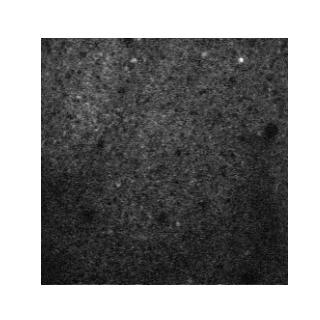
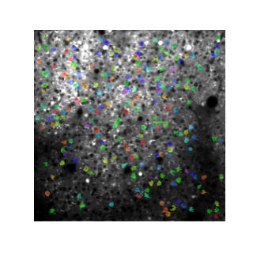
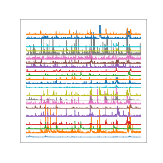

# Concepts

## Multiphoton Calcium Imaging

Over the past two decades, in vivo two-photon laser-scanning imaging of calcium signals
has evolved into a mainstream modality for neurophysiology experiments to record
population activity in intact neural circuits. The tools for signal acquisition and
analysis continue to evolve but common patterns and elements of standardization have
emerged.

The preprocessing workflow for two-photon laser-scanning microscopy includes motion
correction (rigid or non-rigid), cell segmentation, and calcium event extraction
(sometimes described as "deconvolution" or "spike inference"). Some include raster
artifact correction, cropping and stitching operations.

<figure markdown>
  {: style="height:250px"}
  {: style="height:250px"}
  {: style="height:250px"}
  {: style="height:250px"}
  <figcaption>
    Left to right: Raw scans, Motion corrected scans, Cell segmentation, Calcium events
  </figcaption>
</figure>

For a long time, most labs developed custom processing pipelines, sharing them with
others as academic open-source projects. This has changed recently with the emerging of
a few leaders as the standardization candidates for the initial preprocessing.

- [CaImAn](https://github.com/flatironinstitute/CaImAn) (Originally developed by Andrea
  Giovannucci, current support by FlatIron Institute: Eftychios A. Pnevmatikakis,
  Johannes Friedrich)
- [Suite2p](https://github.com/MouseLand/suite2p) (Carsen Stringer and Marius Pachitariu
  at Janelia), 200+ users, active support
- [EXTRACT](https://github.com/schnitzer-lab/EXTRACT-public) (Hakan Inan et al. 2017,
  2021).

Element Calcium Imaging encapsulates these packages to ease the management of data and
its analysis.

## Key partnerships

Over the past few years, several labs have developed DataJoint-based data management and
processing pipelines for two-photon Calcium imaging. Our team collaborated with several
of them during their projects. Additionally, we interviewed these teams to understand
their experiment workflow, pipeline design, associated tools, and interfaces.

These teams include:

- MICrONS (Andreas Tolias Lab, BCM) - https://github.com/cajal
- BrainCoGs (Princeton) - https://github.com/BrainCOGS
- Moser Group (Kavli Institute/NTNU) - private repository
- Anne Churchland Lab (UCLA)

## Acquisition tools

### Hardware

The primary acquisition systems are:

- Sutter
- Thorlabs
- Bruker
- Neurolabware

We do not include Miniscopes in these estimates. In, all there are perhaps on the order
of 3000 two-photon setups globally but their processing needs may need to be further
segmented.

### Software

- Vidrio [ScanImage](https://docs.scanimage.org/)
  - ScanImage is the data acquisition software for two types of home-built scanning two-photon systems, either based on Thorlabs and Sutter hardware. ScanImage has a free version and a licensed version.
- Thorlabs ThorImageLS
- Scanbox
- Nikon NIS-Elements
- Bruker Prairie View

## Element Roadmap

Through our interviews and direct collaboration on the precursor projects, we identified
the common motifs to create Element Calcium Imaging with the repository hosted on [GitHub](https://github.com/datajoint/element-calcium-imaging){:target="_blank"}. Major features include:

- [x] Ingestion of scan metadata, also compatible with mesoscale imaging and
  multi-ROI scanning mode
- [x] Tables for all processing steps: motion correction, cell segmentation, fluorescence trace extraction, spike inference, and cell classification
- [x] Store different curations of the segmentation results
- [x] Ingestion of data acquired with ScanImage, Scanbox, Nikon NIS-Elements, and
  Bruker Prairie View acquisition systems
- [x] Ingestion of processing outputs from both Suite2p and CaImAn analysis suites
- [x] Sample data and complete test suite for quality assurance
- [x] Cell extraction with the EXTRACT analysis package
- [ ] Quality metrics
- [ ] Data compression
- [ ] Deepinterpolation
- [ ] Data export to NWB
- [ ] Data publishing to DANDI

Further development of this Element is community driven. Upon user requests and based on
guidance from the Scientific Steering Group we will continue adding features to this Element.
